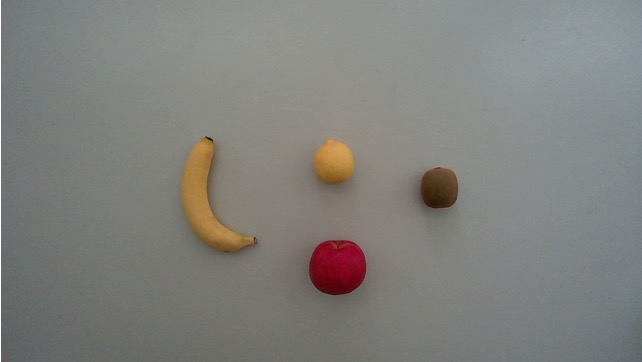
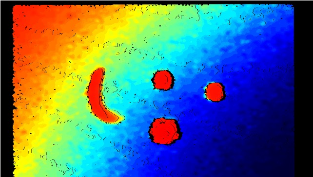
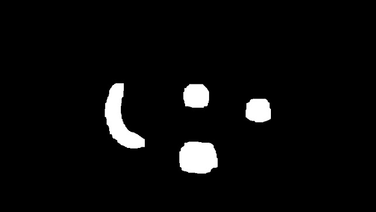

# recognition-and-counting-of-fruits-using-RGBDcamera
RGB-Dカメラを用いた果物の認識・カウント

## 処理の流れ
**画像入力　→ 果物の抽出　→ 色と特徴量の抽出　→ 果物の判別　→ 画像出力**

果物の抽出：背景差分→２値化→平滑化→膨張収縮

色と特徴量の抽出：HSV変換→ラベリング→最頻値計算→周囲長検出→円形度計算

果物の判別：分類木を用いて果物を判別する

画像出力：ラベリングした果物をカウントし、矩形描画でRGB画像上に表示させる

## 特徴

**本プログラムはOpencv3の関数を一切使わず、自ら画像処理の関数を作成します。**

例えば、opencvの２値化の関数は
```
cv::threshold(入力画像,出力画像,閾値,最大値の値,閾値処理の種類); 
```

しかし、本プログラムは原理を深掘りして、自分で２値化関数を作成します。
```
binarization(const cv::Mat1b& src, cv::Mat1b& dst, int thresh)
{
	dst = cv::Mat1b(src.size());
	for (int y = 0; y < src.rows; ++y) {
		for (int x = 0; x < src.cols; ++x) {
			if (src(y, x) < thresh) dst(y, x) = 0;
			else dst(y, x) = 255;
		}
	}
}
```

自作した関数の詳しい内容は
[Opencv3_code](https://github.com/Makito119/Opencv3_code)
をご覧ください

## 画像
* RGB画像


* 深度画像


* 物体の抽出画像


* 出力画像


