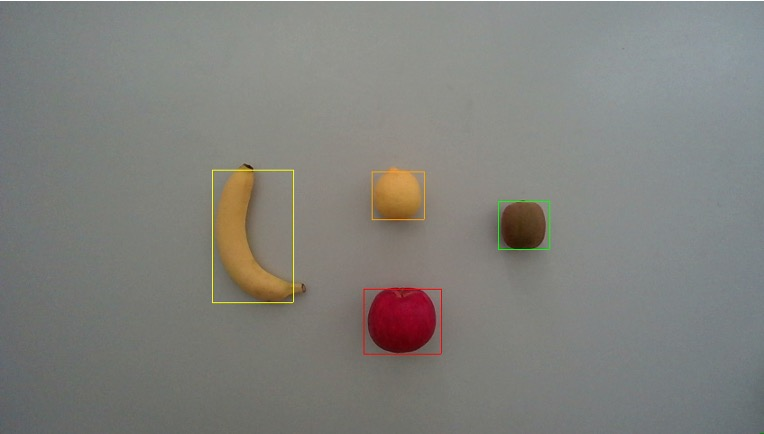

# recognition-and-counting-of-fruits-using-RGBDcamera
RGB-Dカメラを用いた果物の認識・カウント

## 処理の流れ
**画像入力　→ 果物の抽出　→ 色と特徴量の抽出　→ 果物の判別　→ 画像出力**

果物の抽出：背景差分→２値化→平滑化→膨張収縮

色と特徴量の抽出：HSV変換→ラベリング→最頻値計算→周囲長検出→円形度計算

果物の判別：分類木を用いて果物を判別する

画像出力：ラベリングした果物をカウントし、矩形描画でRGB画像上に表示させる

## 特徴

**本プログラムはOpencv3の関数を一切使わず、自ら画像処理の関数を作成します。**

